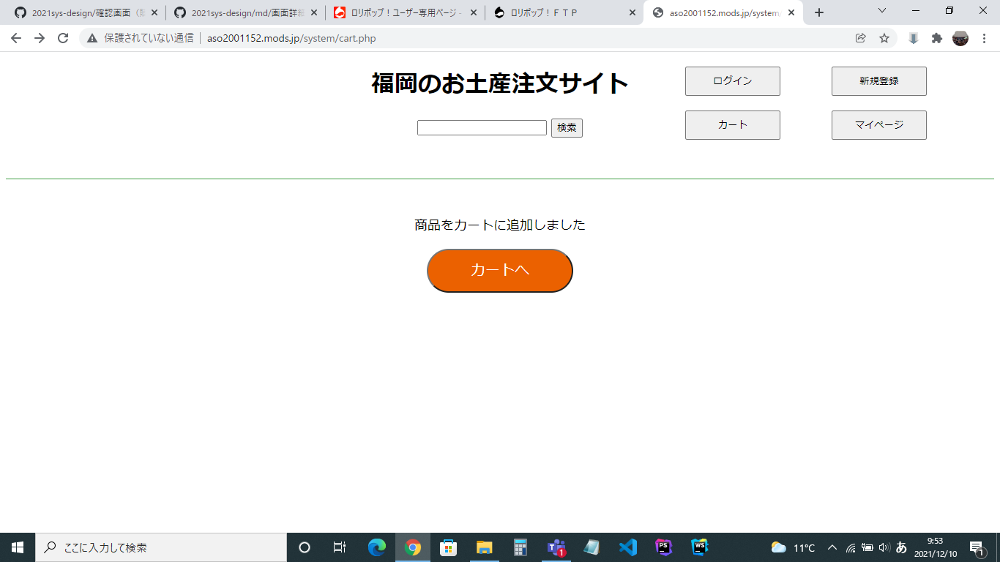

### 画面詳細図
## カートに追加

*****

*****

|ID|要素|内容|アクション|イベント|対応DB|
|--|---|----|---------|-------|-------|
|1   |サイト名|テキスト|サイト名を表示する|-|-|
|2   |商品検索|入力値|５０字まで入力可能|　　　　|○　　　　|
|3   |検索ボタン|ボタン|クリック|検索処理実行|○　　　|
|4   |ログインボタン|ボタン|クリック|ログイン画面に遷移|-|
|5   |新規登録ボタン|ボタン|クリック|新規登録画面に遷移|-|
|6   |カートボタン|ボタン|クリック|カートに遷移|○|
|7   |マイページボタン|ボタン|クリック|マイページに遷移|○|
|8  |追加完了テキスト|テキスト|商品がカートに追加された際に表示|-|-|
|9  |カートへ|ボタン|クリック|カートに遷移|○|
