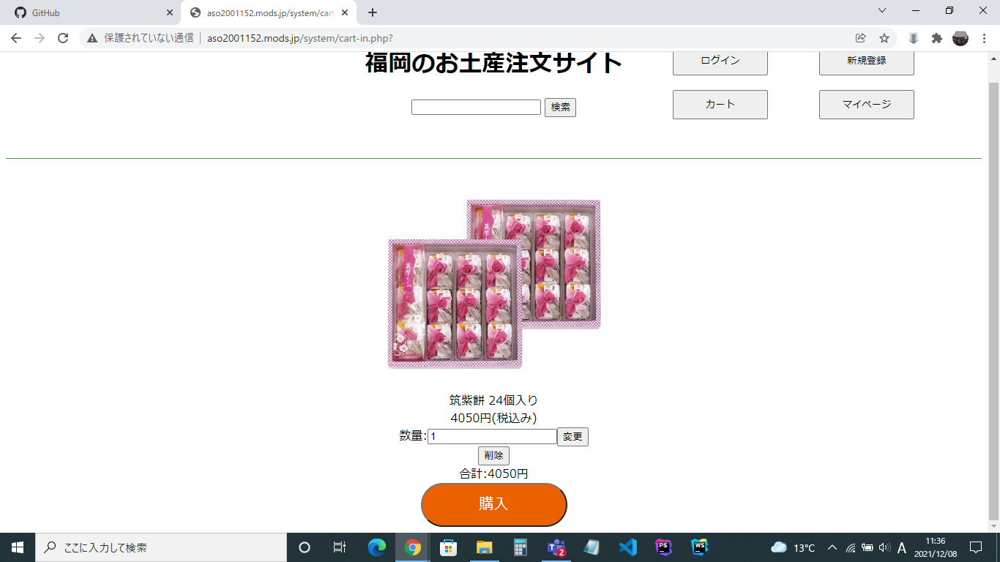

### 画面詳細図
## カートの中

*****

*****

|ID|要素|内容|アクション|イベント|対応DB|
|--|---|----|---------|-------|-------|
|1   |サイト名|テキストリンク|サイト名を表示する|-|-|
|2   |商品検索|入力値|５０字まで入力可能|-　　　　|○　　　　|
|3   |検索ボタン|ボタン|クリック|検索処理実行|○　　　|
|4   |ログインボタン|ボタン|クリック|ログイン画面に遷移|-|
|5   |新規登録ボタン|ボタン|クリック|新規登録画面に遷移|-|
|6   |カートボタン|ボタン|クリック|カートに遷移|○|
|7   |マイページボタン|ボタン|クリック|マイページに遷移|○|
|8  |商品画像|画像|-|-|-|
|9  |筑紫餅 ２４個入り|テキスト|-|-|-|
|10  |４０５０円（税込み）|テキスト|-|-|-|
|11 |数量：|テキスト|-|-|-|
|12  |個数入力|入力値|商品の個数を入力||-|
|12  |合計：４０５０円|テキスト|合計金額|個数と商品数に応じて数値が変化|-|
|13　|購入ボタン|ボタン|クリック|購入確認画面へ遷移する||
