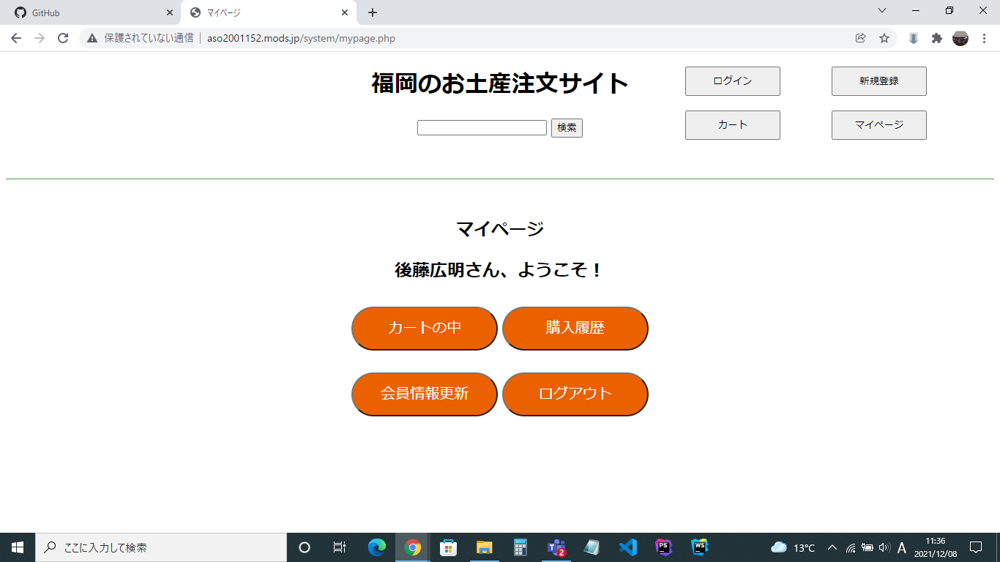

### 画面詳細図
## マイページ
****

****
| ID | 要素 | 内容 | アクション | イベント | 対応DB |
|----|------|------|------------|----------|--------|
|1   |サイト名|テキストリンク|サイト名を表示する|-|-|
|2   |商品検索|入力値|５０字まで入力可能|-　　　　|○　　　　|
|3   |検索ボタン|ボタン|クリック|検索処理実行|○　　　|
|4   |ログインボタン|ボタン|クリック|ログイン画面に遷移|-|
|5   |新規登録ボタン|ボタン|クリック|新規登録画面に遷移|-|
|6   |カートボタン|ボタン|クリック|カートに遷移|○|
|7   |マイページボタン|ボタン|クリック|マイページに遷移|○|
|8   |マイページ|ページ名表示|-      |-          |-        |
|9   |あいさつ|テキスト表示|- 　　　　|登録した名前によって名前の部分が変化|○|
|10   |カートの中|ボタン|クリック|カートの中へ遷移|○|
|11  |購入履歴|ボタン|クリック|ログアウト完了画面へ遷移|○|
|12   |会員情報更新|ボタン|クリック|お気に入りへ遷移|○|
|13  |ログアウト|ボタン|クリック|退会手続き画面へ遷移|○|

