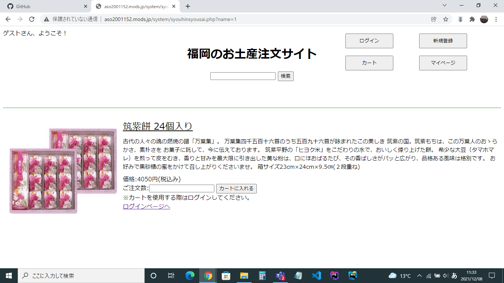

### 画面詳細図
## 商品詳細

*****

*****

|ID|要素|内容|アクション|イベント|対応DB|
|--|---|----|---------|-------|-------|
|1 |サイト名|テキストリンク|サイト名を表示する|-|-|
|2 |商品検索|入力値|５０字まで入力可能|-　　　　|○　　　　|
|3 |検索ボタン|ボタン|クリック|検索処理実行|○　　　|
|4 |ログインボタン|ボタン|クリック|ログイン画面に遷移|-|
|5 |新規登録ボタン|ボタン|クリック|新規登録画面に遷移|-|
|6 |カートボタン|ボタン|クリック|カートに遷移|○|
|7 |マイページボタン|ボタン|クリック|マイページに遷移|○|
|8|商品画像|商品画像を表示|-|-|-|
|9|筑紫餅２４個入り|テキスト表示|-|-|-|
|10|商品説明|テキスト表示|-|-|-|
|11|価格：４０５０円（税込み）|テキスト表示|-|-|-|
|12|ご注文数：|テキスト表示|-|-|-|
|13|個数入力|テキストボックス|数値入力|購入する個数を入力する|-|
|14|カートに入れる|ボタン|クリック|カートに追加|○|
|15|注意書き|テキスト表示|-|-|-|
|16|ログインへ|テキストリンク|クリック|ログインへ遷移する|○|

