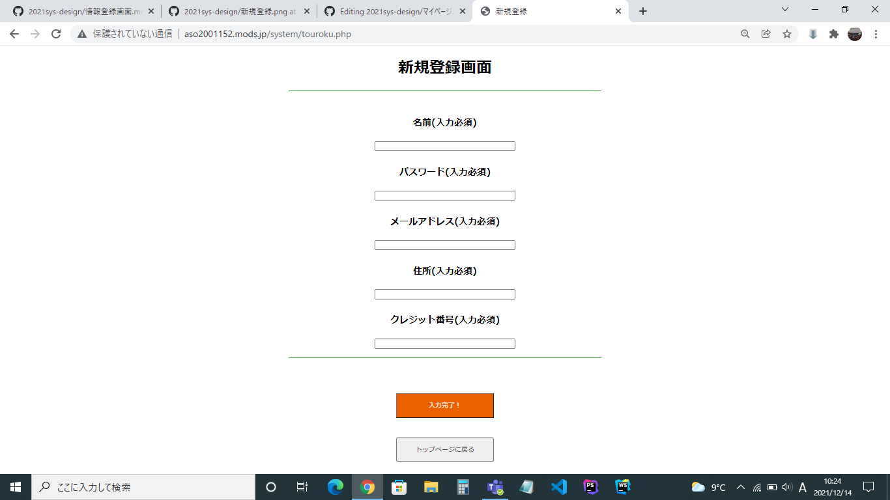

### 画面詳細図
## 新規登録画面
****

****
| ID | 要素 | 内容 | アクション | イベント | 対応DB |
|----|------|------|------------|----------|--------|
|1   |新規登録画面|ページ名表示|-      |-          |-      |
|2   |お名前（必須入力）|テキスト|-        |-      　　　|-　　　|
|3   |お名前入力|テキストボックス|テキスト入力|-     |-  |
|4  |パスワード（必須入力）|テキスト|-　　　|-　　　　|-　　　　|
|5  |パスワード入力|テキストボックス|テキスト入力|-    |-     |
|6  |メールアドレス（必須入力）|テキスト|-　　　|-　　　　|-　　　　|
|7  |メールアドレス入力|テキストボックス|テキスト入力|-    |-     |
|8  |住所（必須入力）|テキスト表示|-　　|-　　　　|-　　　　|
|9  |住所入力|テキストボックス|テキスト入力| -         |-        |
|10 |クレジット番号（必須入力）|テキスト|-                |-       |-      |
|11 |クレジット番号入力|テキストボックス|テキスト入力|-    |-     |
|12 |入力完了！|テキストボタン|クリック|登録完了画面へ遷移|○|
|13 |トップページに戻る|テキストボタン|クリック|トップページへ遷移|○|

