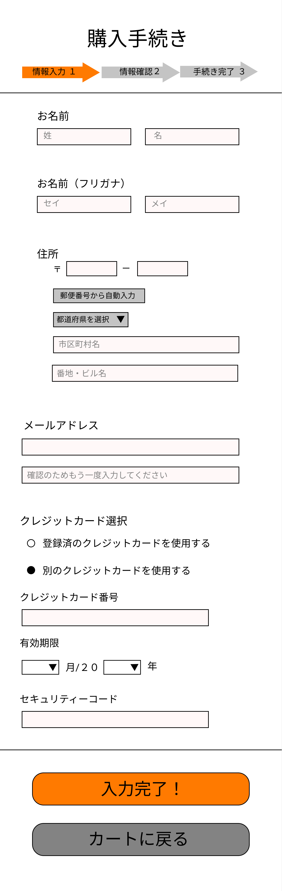

### 画面詳細図
## 購入手続き
[購入手続きはこちらから](https://www.figma.com/file/IJc3PbVAxiKaZIyg0KVQO9/購入手続き?node-id=0%3A1)
****

****
| ID | 要素 | 内容 | アクション | イベント | 対応DB |
|----|------|------|------------|----------|--------|
|1   |バナー|ページ名表示|-      |-          |-      |
|2   |情報入力|テキストアイコン|-        |-      |-|
|3   |情報確認|テキストアイコン|-        |-      |-|
|4   |手続き完了|テキストアイコン|-        　　|-      |-|
|5   |お名前|テキスト|-        |-      　　　|-　　　|
|6   |氏名|テキスト|-           |-           |-       |
|6   |氏名入力|テキスト|ボックステキスト入力|氏名を入力する  |-       |
|7   |名前|テキスト|-            |-        |-        |
|6   |名前入力|テキストボックス|テキスト入力|名前を入力する  |-       |
|9   |氏名(フリガナ)|テキスト|-           |-      |-      |
|6   |氏名（フリガナ）入力|テキストボックス|テキスト入力|氏名（フリガナ）を入力する  |-       |
|8   |名前(フリガナ)|テキスト|-        |-  　　　|-　　　|
|6   |名前（フリガナ）入力|テキストボックス|テキスト入力|名前（フリガナ）を入力する  |-       |
|11  |住所|テキスト表示|-　　|-　　　　|-　   　　　|
|12  |郵便番号|テキスト|-            |-     |-         |
|6   |郵便番号入力|テキストボックス|テキスト入力|郵便番号を入力する  |-       |
|6   |郵便番号から自動入力|テキストボタン|クリック|郵便番号が入力されていると住所が自動入力される  |○      |
|13  |都道府県を選択|リストメニュー |クリック|４７都道府県から１つ選択する|○|
|14  |住所|テキスト|-              | -  -       |       |
|14  |住所入力|テキストボックス|テキスト入力 |住所を入力する|-        |
|15  |番地・ビル名|テキスト|-       | -         |-        |
|15  |番地・ビル名入力|テキストボックス|テキスト入力|番地、ビル名を入力する|-        |
|16  |メールアドレス|テキスト|-　　　|-　　　　|-　　　　|
|17  |メールアドレス入力|テキストボックス|テキスト入力|メールアドレスを入力する|-     |
|18  |メールアドレス(確認用)|テキスト|-       |-    |-     |
|18  |メールアドレス(確認用)入力|テキストボックス|テキスト入力|メールアドレス（確認用）を入力する|-     |
|19  |クレジットカード選択|テキスト|-　　　|-　　　　|-　　　　|
|20  |登録済のクレジットカードを使用する|テキスト|-       |-    |-     |
|20  |○|チェックボックス|クリック   |支払い時に事前に登録されたクレジットカード情報が使用される    |-     |
|21  |別のクレジットカードを使用する|テキスト|-      | 購入手続きで選ばれた方のチェックリストを黒くする   |-     |
|20  |●|チェックボックス|クリック   |選択するとクレジットカード番号入力、有効期限入力、セキュリティーコード入力が表示される    |-     |
|22  |クレジットカード番号|テキスト|-　　　|-　　　　|-　　　　|
|23  |クレジットカード番号（入力）|テキストボックス|テキスト入力  | １６桁のクレジットカード番号を入力する  |-         |
|24  |有効期限|テキスト|-       |-         |-       |
|25  |２０２５年|テキスト|-       |-          |-        |
|26  |３月|テキスト|-                |-       |-      |
|27  |セキュリティーコード|テキスト|-      |-         |-         |
|28  |セキュリティーコード（入力）|テキスト|-      |セキュリティーコードは隠す         |-         |
|29  |確定する|テキストボタン|クリック|購入完了へ遷移|○|
|30  |入力画面に戻る|テキストボタン|クリック|購入手続きへ遷移|○|

